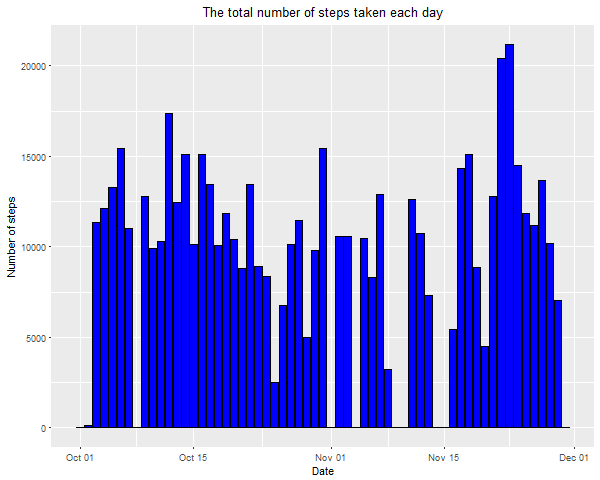
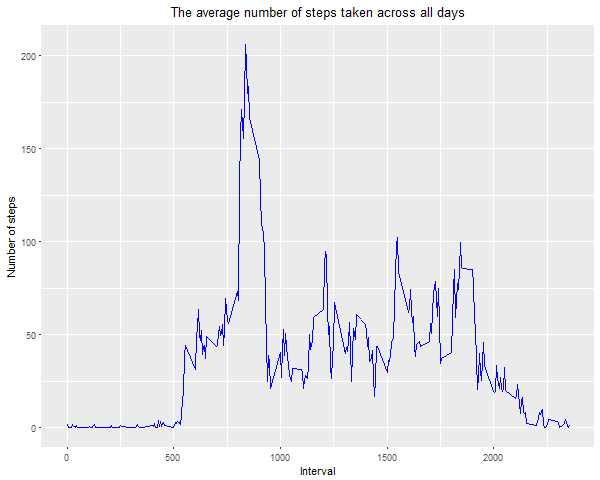
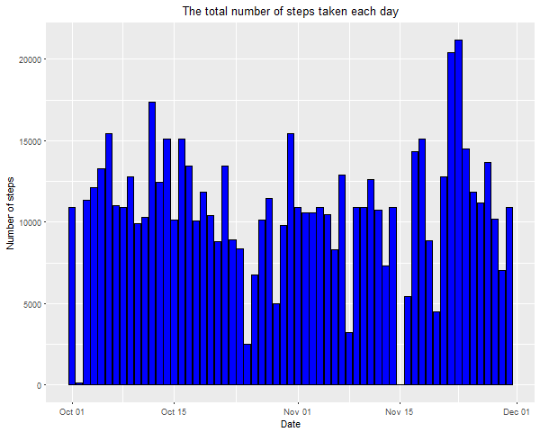
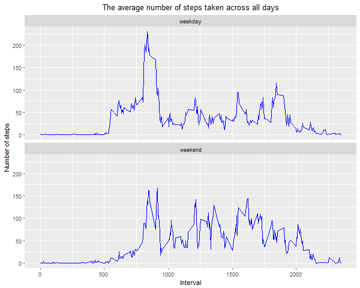

## Loading and preprocessing the data

-------------------------------------

Name of dataset used in this assignment: ```Activity monitoring data```.
[URL](https://d396qusza40orc.cloudfront.net/repdata%2Fdata%2Factivity.zip) for the dataset:

```r
data.zip.url <- "https://d396qusza40orc.cloudfront.net/repdata%2Fdata%2Factivity.zip"
```

Download the zip file (if it doesn't exist inside the working directory) and unzip it:

```r
zip.file <- file.path("./", "activity.zip")

if (!file.exists(zip.file)) {
     download.file(data.zip.url, zip.file)
} 

if (length(list.files(path = "./", pattern = "\\.csv$")) == 0) {
     unzip(zip.file)
}

list.files(path = "./", pattern = "\\.csv$|\\.zip$")
```

```
## [1] "activity.csv" "activity.zip"
```

Save csv file name into a variable:

```r
csv.file <- list.files(path = "./", pattern = "\\.csv$")[1]
```

Then read our csv file:

```r
library(readr)
ds <- read_csv(csv.file)
```

```
## Parsed with column specification:
## cols(
##   steps = col_integer(),
##   date = col_date(format = ""),
##   interval = col_integer()
## )
```

Look at the structure of our dataset:

```r
str(ds)
```

```
## Classes 'tbl_df', 'tbl' and 'data.frame':	17568 obs. of  3 variables:
##  $ steps   : int  NA NA NA NA NA NA NA NA NA NA ...
##  $ date    : Date, format: "2012-10-01" "2012-10-01" ...
##  $ interval: int  0 5 10 15 20 25 30 35 40 45 ...
##  - attr(*, "spec")=List of 2
##   ..$ cols   :List of 3
##   .. ..$ steps   : list()
##   .. .. ..- attr(*, "class")= chr  "collector_integer" "collector"
##   .. ..$ date    :List of 1
##   .. .. ..$ format: chr ""
##   .. .. ..- attr(*, "class")= chr  "collector_date" "collector"
##   .. ..$ interval: list()
##   .. .. ..- attr(*, "class")= chr  "collector_integer" "collector"
##   ..$ default: list()
##   .. ..- attr(*, "class")= chr  "collector_guess" "collector"
##   ..- attr(*, "class")= chr "col_spec"
```
It looks like the ```steps``` variable contains a lot of NA values. 

Now look at the data itself:

```r
head(ds)
```

```
## # A tibble: 6 x 3
##   steps       date interval
##   <int>     <date>    <int>
## 1    NA 2012-10-01        0
## 2    NA 2012-10-01        5
## 3    NA 2012-10-01       10
## 4    NA 2012-10-01       15
## 5    NA 2012-10-01       20
## 6    NA 2012-10-01       25
```

```r
summary(ds)
```

```
##      steps             date               interval     
##  Min.   :  0.00   Min.   :2012-10-01   Min.   :   0.0  
##  1st Qu.:  0.00   1st Qu.:2012-10-16   1st Qu.: 588.8  
##  Median :  0.00   Median :2012-10-31   Median :1177.5  
##  Mean   : 37.38   Mean   :2012-10-31   Mean   :1177.5  
##  3rd Qu.: 12.00   3rd Qu.:2012-11-15   3rd Qu.:1766.2  
##  Max.   :806.00   Max.   :2012-11-30   Max.   :2355.0  
##  NA's   :2304
```

Ok, it's time to answer some exploratory questions. 

## Q1 What is mean total number of steps taken per day?

----------------------------------------------------

>1. Calculate the total number of steps taken per day:


```r
library(dplyr)
```

```
## 
## Attaching package: 'dplyr'
```

```
## The following objects are masked from 'package:stats':
## 
##     filter, lag
```

```
## The following objects are masked from 'package:base':
## 
##     intersect, setdiff, setequal, union
```

```r
total.steps <- select(ds, date, steps) %>% 
                 group_by(date) %>% 
                   summarize(value = sum(steps, na.rm = TRUE))                                    
total.steps
```

```
## # A tibble: 61 x 2
##          date value
##        <date> <int>
##  1 2012-10-01     0
##  2 2012-10-02   126
##  3 2012-10-03 11352
##  4 2012-10-04 12116
##  5 2012-10-05 13294
##  6 2012-10-06 15420
##  7 2012-10-07 11015
##  8 2012-10-08     0
##  9 2012-10-09 12811
## 10 2012-10-10  9900
## # ... with 51 more rows
```

>2. Make a histogram of the total number of steps taken each day:


```r
fig.dir <- "./figures"
png.file <- paste0(fig.dir, "/", "hist_total_num_of_steps.png")

if (!file.exists(fig.dir)) {
     dir.create(fig.dir)
}
png(filename = png.file, width = 600, height = 480, units = "px")

library(ggplot2)
ggplot(total.steps, aes(x = date, y = value)) +
       geom_histogram(stat = "identity", color = "black", fill = "blue") +
       ggtitle("The total number of steps taken each day") +
       xlab("Date") +
       ylab("Number of steps") +
       theme(plot.title = element_text(hjust = 0.5))
```

```
## Warning: Ignoring unknown parameters: binwidth, bins, pad
```

```r
dev.off()
```

```
## png 
##   2
```


What we see in the histogram above? For some days there are no steps, i.e steps = 0. The reason could be a missing values in `steps` variable.

>3. Calculate and report the mean and median of the total number of steps taken per day:


```r
mean.total.steps <- mean(total.steps$value)
median.total.steps <- median(total.steps$value)

mean.total.steps
```

```
## [1] 9354.23
```

```r
median.total.steps
```

```
## [1] 10395
```

So the mean of the total number of steps taken per day is 9354.2295082, and median equals 10395

## Q2 What is the average daily activity pattern?

----------------------------------------------

>1. Make a time series plot (i.e. type = "l") of the 5-minute interval (x-axis) and the average number of steps taken, averaged across all days (y-axis)

Calculate the average number of steps across all days per each interval:

```r
mean.steps <- select(ds, interval, steps) %>% 
                group_by(interval) %>% 
                  summarize(value = mean(steps, na.rm = TRUE))                                    
mean.steps
```

```
## # A tibble: 288 x 2
##    interval     value
##       <int>     <dbl>
##  1        0 1.7169811
##  2        5 0.3396226
##  3       10 0.1320755
##  4       15 0.1509434
##  5       20 0.0754717
##  6       25 2.0943396
##  7       30 0.5283019
##  8       35 0.8679245
##  9       40 0.0000000
## 10       45 1.4716981
## # ... with 278 more rows
```

Plot it:

```r
png.file <- paste0(fig.dir, "/", "plot_average_of_steps.png")
png(filename = png.file, width = 600, height = 480, units = "px")

ggplot(mean.steps, aes(x = interval, y = value)) + 
       geom_line(color = "blue") + 
       ggtitle("The average number of steps taken across all days") +
       xlab("Interval") + 
       ylab("Number of steps") + 
       theme(plot.title = element_text(hjust = 0.5))

dev.off()
```

```
## png 
##   2
```


As we can see in the figure, the most of steps are taken between intervals 5:00 and 20:00. It looks like a pattern, a daily schedule of average person.

>2. Which 5-minute interval, on average across all the days in the dataset, contains the maximum number of steps?

The maximum number of steps in this interval:

```r
mean.steps[which.max(mean.steps$value),]
```

```
## # A tibble: 1 x 2
##   interval    value
##      <int>    <dbl>
## 1      835 206.1698
```


## Imputing missing values

---------------------------

>1. Calculate and report the total number of missing values in the dataset (i.e. the total number of rows with NA)


```r
NA.steps.ind <- is.na(ds)
sum(NA.steps.ind)
```

```
## [1] 2304
```

>2. Devise a strategy for filling in all of the missing values in the dataset. 

I choose `mean.steps` a pre-calculated values of mean for each interval to fill all NAs.

```r
mean.steps
```

```
## # A tibble: 288 x 2
##    interval     value
##       <int>     <dbl>
##  1        0 1.7169811
##  2        5 0.3396226
##  3       10 0.1320755
##  4       15 0.1509434
##  5       20 0.0754717
##  6       25 2.0943396
##  7       30 0.5283019
##  8       35 0.8679245
##  9       40 0.0000000
## 10       45 1.4716981
## # ... with 278 more rows
```

>3. Create a new dataset that is equal to the original dataset but with the missing data filled in.


```r
ds.imputed <- 
filter(ds, is.na(steps)) %>% 
  inner_join(mean.steps, by=c("interval")) %>% 
    mutate(steps = ceiling(value)) %>% 
     select(-value) %>% 
       union_all(ds[!is.na(ds$steps),])
ds.imputed
```

```
## # A tibble: 17,568 x 3
##    steps       date interval
##    <dbl>     <date>    <int>
##  1     2 2012-10-01        0
##  2     1 2012-10-01        5
##  3     1 2012-10-01       10
##  4     1 2012-10-01       15
##  5     1 2012-10-01       20
##  6     3 2012-10-01       25
##  7     1 2012-10-01       30
##  8     1 2012-10-01       35
##  9     0 2012-10-01       40
## 10     2 2012-10-01       45
## # ... with 17,558 more rows
```

```r
sum(is.na(ds.imputed))
```

```
## [1] 0
```

>4. Make a histogram of the total number of steps taken each day and Calculate and report the mean and median total number of steps taken per day. Do these values differ from the estimates from the first part of the assignment? What is the impact of imputing missing data on the estimates of the total daily number of steps?


```r
total.steps2 <- select(ds.imputed, date, steps) %>% 
                  group_by(date) %>% 
                    summarize(value = sum(steps))   

png.file <- paste0(fig.dir, "/", "hist_total_num_of_steps2.png")
png(filename = png.file, width = 600, height = 480, units = "px")

ggplot(total.steps2, aes(x = date, y = value)) +
       geom_histogram(stat = "identity", color = "black", fill = "blue") +
       ggtitle("The total number of steps taken each day") +
       xlab("Date") +
       ylab("Number of steps") +
       theme(plot.title = element_text(hjust = 0.5))
```

```
## Warning: Ignoring unknown parameters: binwidth, bins, pad
```

```r
dev.off()
```

```
## png 
##   2
```


After filling NA values our histogram looks slightly different. 

Calculate the mean/median again for our imputed dataset:

```r
mean.total.steps2 <- mean(total.steps2$value)
median.total.steps2 <- median(total.steps2$value)

mean.total.steps2
```

```
## [1] 10784.92
```

```r
median.total.steps2
```

```
## [1] 10909
```

Compare it with previous values:

```r
data.frame(old = c(mean.total.steps, median.total.steps), 
           new = c(mean.total.steps2,median.total.steps2),
           row.names = c("mean", "median"))
```

```
##             old      new
## mean    9354.23 10784.92
## median 10395.00 10909.00
```


## Q3 Are there differences in activity patterns between weekdays and weekends?

----------------------------------------------------------------------------

>1. Create a new factor variable in the dataset with two levels – “weekday” and “weekend” indicating whether a given date is a weekday or weekend day.


```r
ds.imputed <- mutate(ds.imputed, 
                     day.type = factor(ifelse(weekdays(date, TRUE) %in% c("Sat", "Sun"), 
                                              "weekend",
                                              "weekday")))
ds.imputed
```

```
## # A tibble: 17,568 x 4
##    steps       date interval day.type
##    <dbl>     <date>    <int>   <fctr>
##  1     2 2012-10-01        0  weekday
##  2     1 2012-10-01        5  weekday
##  3     1 2012-10-01       10  weekday
##  4     1 2012-10-01       15  weekday
##  5     1 2012-10-01       20  weekday
##  6     3 2012-10-01       25  weekday
##  7     1 2012-10-01       30  weekday
##  8     1 2012-10-01       35  weekday
##  9     0 2012-10-01       40  weekday
## 10     2 2012-10-01       45  weekday
## # ... with 17,558 more rows
```

```r
str(ds.imputed)
```

```
## Classes 'tbl_df', 'tbl' and 'data.frame':	17568 obs. of  4 variables:
##  $ steps   : num  2 1 1 1 1 3 1 1 0 2 ...
##  $ date    : Date, format: "2012-10-01" "2012-10-01" ...
##  $ interval: int  0 5 10 15 20 25 30 35 40 45 ...
##  $ day.type: Factor w/ 2 levels "weekday","weekend": 1 1 1 1 1 1 1 1 1 1 ...
```

>2. Panel plot comparing the average number of steps taken per 5-minute interval across weekdays and weekends


```r
mean.steps2 <- select(ds.imputed, day.type, interval, steps) %>% 
                 group_by(day.type, interval) %>% 
                   summarize(value = mean(steps))     

png.file <- paste0(fig.dir, "/", "plot_average_of_steps2.png")
png(filename = png.file, width = 600, height = 480, units = "px")

ggplot(mean.steps2, aes(x = interval, y = value)) + 
       geom_line(color = "blue") + 
       ggtitle("The average number of steps taken across all days") +
       xlab("Interval") + 
       ylab("Number of steps") + 
       theme(plot.title = element_text(hjust = 0.5)) + 
       facet_wrap(~day.type, nrow = 2)

dev.off()
```

```
## png 
##   2
```


On weekends the number of steps increases roughly after interval 8:00 and decreases after 21:00, while on weekdays it is true for intervals 06:00 and 19:00.
